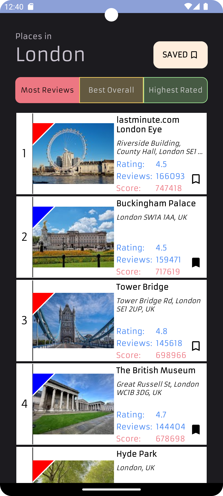
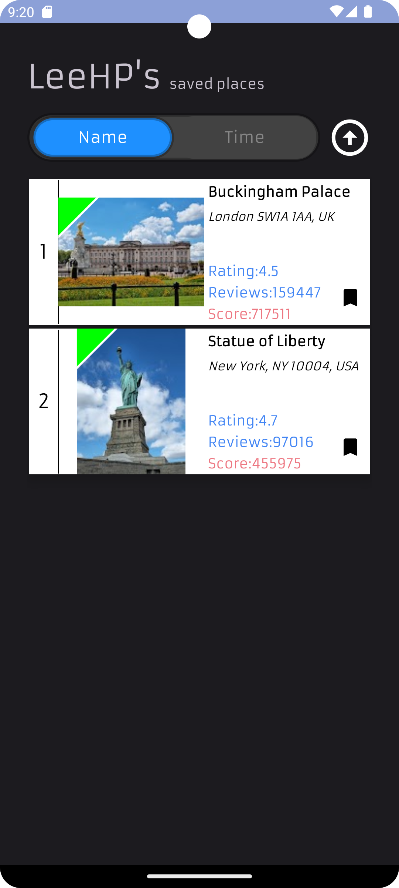

# Top Rated App (Android App)
[Full Project Report (pdf)](SUMMARY%2FReport%20-%20Project%202.pdf)

### This app lets users search for a location (eg. New York City) and returns the top places in Google Maps based on rating/number or reviews/both.

## Features
- App allows users to signup/login using Firebase Auth
- The search results will show the place name, address, picture, rating, number of reviews and score (rating x number of reviews)
- Users can save the places to the Firebase Realtime Database
- When user clicks into their saved places page, it shows all their saved places where users can view it sorted by Name or by Saved time, either ascending or descending
- Uses Google Places API
- Dark theme
- Chinese language support

### Supports Chinese language

